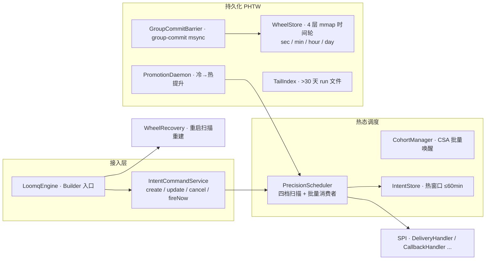

# LoomQ

> 为分布式系统设计的**持久化时间内核** —— 调度、持久化、并在未来时刻可靠投递事件（Intent）。

[](https://github.com/loomq/loomq/actions/workflows/ci.yml)
[](LICENSE)

  

- **零依赖嵌入式**：编译期仅依赖 `slf4j-api`，可嵌入任意 Java 25 应用。
- **四档精度**：`MILLI`(1ms) 到 `STANDARD`(500ms)，按需取舍吞吐与触发精度。
- **持久化内核**：基于 PHTW（持久化分层时间轮）落盘，重启可完全恢复。

---

## 特性

- **持久化内核，重启不丢** — 基于 PHTW（持久化分层时间轮：4 层 mmap 时间轮 + TailIndex）落盘，**无 WAL、无快照**，重启扫描重建。
- **四档精度** — `MILLI`(1ms) / `ULTRA`(10ms) / `FAST`(50ms) / `STANDARD`(500ms)，按需取舍吞吐与触发精度。
- **冷 / 热分层** — 60 分钟热窗口驻留内存；更远的冷 Intent 只落盘、不占内存，靠 `PromotionDaemon` 提前唤醒。
- **虚拟线程并发** — 全部基于 Virtual Threads，无传统线程池调参。
- **崩溃恢复** — `WheelRecovery` 扫描重建，终态不补投，避免对下游产生过时事件。
- **重试编排 + 死信 + 过期处理** — 内置重投退避、`DEAD_LETTER`、`EXPIRED` 分支。
- **SPI 扩展点** — `DeliveryHandler` / `CallbackHandler` / `IntentObserver` / `RedeliveryDecider`，内核不内置任何投递机制。
- **幂等创建** — 业务幂等键去重。

---

## 快速开始

```java
import com.loomq.LoomqEngine;
import com.loomq.domain.intent.AckMode;
import com.loomq.domain.intent.Intent;
import com.loomq.domain.intent.PrecisionTier;
import com.loomq.spi.DeliveryHandler;
import java.time.Instant;
import java.util.concurrent.CompletableFuture;

// 1. 构建引擎（零外部依赖，仅需 JDK 25）
LoomqEngine engine = LoomqEngine.builder()
    .deliveryHandler(intent -> {
        System.out.println("到点投递: " + intent.getIntentId());
        return CompletableFuture.completedFuture(DeliveryHandler.DeliveryResult.SUCCESS);
    })
    .build();
engine.start();

// 2. 创建一个 5 秒后触发的 Intent
Intent intent = new Intent();
intent.setExecuteAt(Instant.now().plusSeconds(5));
intent.setPrecisionTier(PrecisionTier.MILLI);   // 毫秒级触发

// 3. DURABLE：落盘（group-commit msync）后才返回
engine.createIntent(intent, AckMode.DURABLE).join();

// 4. 优雅关闭 —— 强制脏桶落盘，排空在途投递
engine.close();
```

构建与测试：

```bash
mvn clean package        # 全量构建（含测试）
make check               # 本地模拟 CI 门禁（format + test）
```

---

## 架构总览



**Intent 生命周期：** `CREATED → SCHEDULED → DUE → DISPATCHING → DELIVERED → ACKED`（分支：`CANCELED`、`EXPIRED`、`DEAD_LETTERED`）。

---

## 精度档位

| 档位 | 精度窗口 | 扫描模式 | 最大并发 | 消费者数 | 队列容量 | 默认 WalMode |
|------|---------:|---------|---------:|---------:|---------:|--------------|
| `MILLI` | 1 ms | 事件驱动 | 100 | 8 | 1600 | DURABLE |
| `ULTRA` | 10 ms | 事件驱动 | 200 | 16 | 3200 | DURABLE |
| `FAST` | 50 ms | 固定轮询 | 150 | 12 | 2400 | DURABLE |
| `STANDARD` | 500 ms | 固定轮询 | 50 | 3 | 800 | DURABLE |

`MILLI` / `ULTRA` 走事件驱动扫描 + 信号驱动消费，空闲 CPU 不劣化；`FAST` / `STANDARD` 走固定轮询 + 批量消费，吞吐优先。

---

## 持久化与可靠性（PHTW）

持久化栈由 `WheelStore`（4 层 mmap 时间轮，append-only）+ `TailIndex`（超 30 天 run 文件）+ `GroupCommitBarrier`（group-commit msync）+ `IntentLocationIndex` + `PromotionDaemon` + `WheelRecovery` 构成。**磁盘是权威，内存 `IntentStore` 只是热窗口镜像；无 WAL、无快照**。

| AckMode | 持久化 | API 返回时机 | 崩溃窗口 |
|:--------|:-------|:------------|:---------|
| `DURABLE`（默认） | 阻塞至 group-commit msync 落盘 | 落盘后返回 | 无 |
| `ASYNC` | mmap 写入即返回，daemon 周期落盘 | 内存写入后立即返回 | 有（≤ group-commit 周期 1ms） |
| `REPLICATED` | 预留多副本确认 | — | 无（未来集群，当前映射 `DURABLE`） |

- 状态变更操作（`update` / `cancel` / `fireNow`）**硬编码 DURABLE**，即使 Intent 以 `ASYNC` 创建，其取消/改期也必然落盘后才返回。
- 重启 `WheelRecovery` 按 **max revision** 去重（append-only 旧槽残留），终态不补投，避免对下游产生过时事件。

---

## 基准测试

> 数字来自受控环境实测，硬件 / 负载不同会有差异。完整 SLO 与复现方式见 [`benchmark/README.md`](benchmark/README.md)。

**Windows** · Microsoft Windows 10.0.26200 · 22 核 · JDK 25.0.4 · commit `7acb8c5`

| 创建吞吐 | 单发 | 批量 |
|---------|------:|-----:|
| **QPS** | 11,628 | 45,455 |

| 档位 | QPS | wake p50/p99 | e2e p50/p99 | 触发精度 p50/p99/p999 |
|------|----:|-------------|-------------|----------------------|
| MILLI | 56,818 | 0 / 2 ms | 7 / 13 ms | 0 / 1 / 1 ms |
| ULTRA | 96,154 | 0 / 0 ms | 4 / 6 ms | 0 / 1 / 1 ms |
| FAST | 14,706 | 25 / 25 ms | 44 / 52 ms | 10 / 25 / 25 ms |
| STANDARD | 2,189 | 100 / 250 ms | 216 / 475 ms | 100 / 250 / 250 ms |

**WSL (Ubuntu)** · Linux 6.6.87.2-microsoft-standard-WSL2 · 22 核 · openjdk 25.0.4 · commit `7acb8c5`

| 创建吞吐 | 单发 | 批量 |
|---------|------:|-----:|
| **QPS** | 3,333 | 62,500 |

| 档位 | QPS | wake p50/p99 | e2e p50/p99 | 触发精度 p50/p99/p999 |
|------|----:|-------------|-------------|----------------------|
| MILLI | 86,207 | 0 / 0 ms | 4 / 7 ms | 0 / 1 / 1 ms |
| ULTRA | 147,059 | 0 / 0 ms | 2 / 5 ms | 0 / 0 / 1 ms |
| FAST | 12,755 | 25 / 25 ms | 34 / 50 ms | 10 / 25 / 25 ms |
| STANDARD | 1,485 | 250 / 250 ms | 275 / 492 ms | 100 / 250 / 250 ms |

---

## 设计边界

LoomQ 内核**不**负责以下职责，它们留给上层 shell（如未来的 `loomqex`）：

- 不内置 HTTP / gRPC 传输层。
- 不做集群复制、leader 选举、租约与 fencing。
- 冷 Intent（超过 60min 热窗口）支持**取消**，但暂不支持冷改期 / 冷 fireNow。
- 单节点内核定位；`REPLICATED` 为多副本能力预留。

---

## Roadmap

- **loomqex shell** — HTTP / gRPC 传输层 + 集群复制 + 租约 / 选举。
- **REPLICATED 落地** — 真正的多副本确认。
- **冷操作补全** — 冷改期 / 冷 fireNow。
- **SlotCodec 改按 name 持久化** — 解除枚举 ordinal 耦合（当前新增档位必须追加到枚举末尾）。

---

## License

[MIT](LICENSE) © 2026 Xu Yuchen