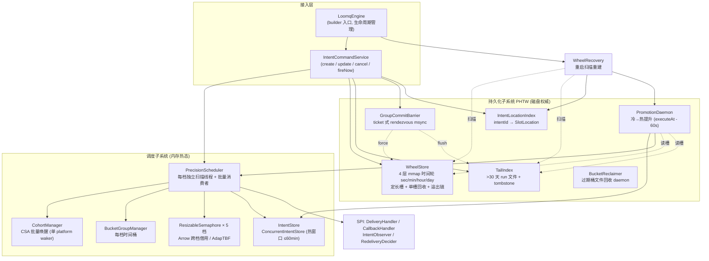
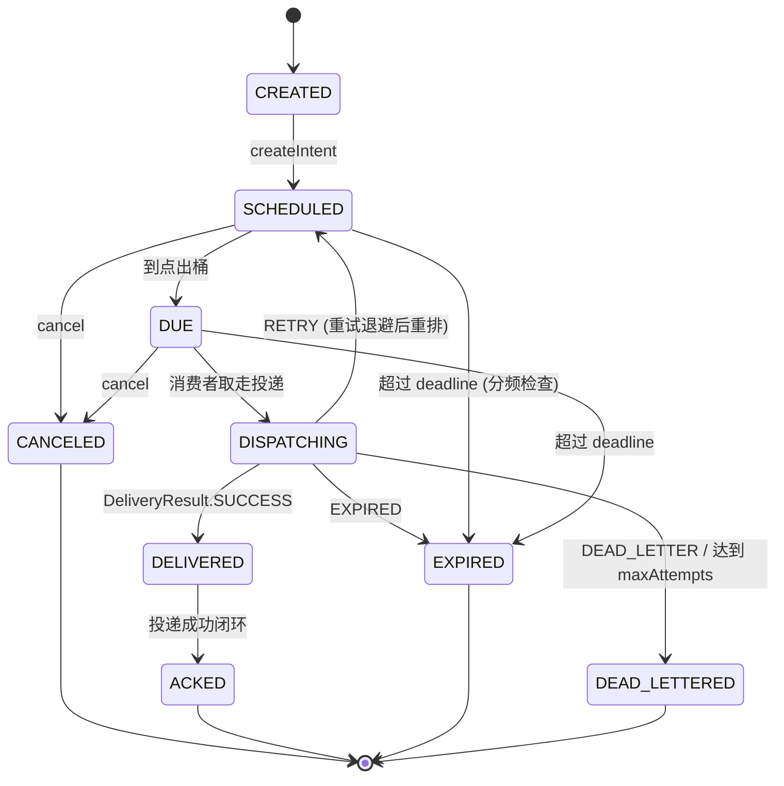

# LoomQ 架构文档

> 本文档描述 LoomQ **当前实际架构**，以 `loomq-core` 源码（v0.9.2+）为准。
>
> **重要变更说明**：本项目已重构为**单模块嵌入式内核**。早期版本中的 `loomq-server`、`loomq-channel-http`、`loomq-channel-grpc` 多模块，以及 **Raft 复制、Snapshot/WAL 恢复**等机制均已移除。凡旧文档与本文冲突之处，以本文与代码为准。

## 1. 定位与设计边界

LoomQ 是分布式系统的**持久化时间内核**（durable time kernel）：调度、持久化、并在未来时刻可靠投递事件（**Intent**）。

### 1.1 单模块与零依赖承诺

- **单模块**：Maven 仅含 `loomq-core` 一个模块（见根 `pom.xml`），可嵌入任意宿主应用。
- **零依赖**：编译期唯一依赖是 `slf4j-api`（见 `loomq-core/pom.xml`）；无 HTTP/JSON/网络/数据库依赖。JUnit/Mockito 仅 test scope。
- **Java 25 + 虚拟线程**：批量消费者、回调、引擎操作均跑在 `Executors.newVirtualThreadPerTaskExecutor()` 上，无传统线程池调参；少量精确定时的守护线程（cohort-waker、group-commit、promotion）使用平台线程。

### 1.2 职责边界

内核负责：持久化调度、改期（热）、过期处理、重启恢复、重试编排、时间驱动的执行钩子。

内核**不**负责（留给上层 shell，如未来的 `loomqex`）：HTTP/gRPC 传输、集群复制、锁语义、租约与 fencing、leader 选举、业务预订规则。多副本语义仅在 `AckMode.REPLICATED` 中预留（当前映射为 `DURABLE`）。

## 2. 总体架构



引擎启动顺序（`LoomqEngine.start()`）：`WheelRecovery.recover()` → `GroupCommitBarrier.start()` → `PromotionDaemon.start()` → `PrecisionScheduler.start()`。关闭顺序相反，且 `wheelStore.close()` 前会先 `forceDirty()` 强制脏桶落盘。

## 3. 核心概念

### 3.1 Intent 生命周期

状态机定义于 `domain/intent/IntentStatus.java`：



| 状态 | 含义 | 终态 |
|------|------|------|
| CREATED | 初始态（瞬时） | 否 |
| SCHEDULED | 已进入调度器（桶或 cohort） | 否 |
| DUE | 到点待投递 | 否 |
| DISPATCHING | 正在投递 | 否 |
| DELIVERED | 请求已发出（成功路径中瞬时转入 ACKED） | 否 |
| ACKED | 已确认 | 是 |
| CANCELED | 用户取消（枚举名为单 L 的 `CANCELED`） | 是 |
| EXPIRED | 超过 deadline 且 `expiredAction=DISCARD` | 是 |
| DEAD_LETTERED | 达到最大重试次数或被判死信 | 是 |

说明：`DUE`/`DISPATCHING` 等中间态主要在内存流转（`finalizeIntent` 中瞬时穿过），终态才做 `intentStore.update()` + PHTW 落盘。可取消状态为 `SCHEDULED` 与 `DUE`。

**取消语义**：cancel 是 best-effort 操作。对于已进入 DISPATCHING 状态的 Intent，异步投递可能已完成、事件可能已到达下游，cancel 无法撤销。下游业务方必须自行保证处理逻辑的幂等性。

### 3.2 四档精度

预置于 `PrecisionTierCatalog.createDefault()`，默认档位 **STANDARD**。每档拥有独立的扫描线程、有界派发队列、批量消费者组和信号量。

| 档位 | 精度窗口 | 扫描间隔 | 最大并发 | 批量大小 | 批量窗口 | 消费者数 | 队列容量 | 默认 WalMode |
|------|---------:|---------:|---------:|---------:|---------:|---------:|---------:|--------------|
| ULTRA | 10 ms | 10 ms | 200 | 1（单发） | 5 ms | 16 | 3200 | DURABLE |
| FAST | 50 ms | 50 ms | 150 | 1（单发） | 10 ms | 12 | 2400 | DURABLE |
| STANDARD | 500 ms | 500 ms | 50 | 20 | 100 ms | 3 | 800 | DURABLE |
| MILLI | 1 ms | 1 ms | 100 | 1（单发） | 1 ms | 8 | 1600 | DURABLE |

`batchSize=1` 的档位（ULTRA/FAST）走单 Intent 消费循环；其余走 `drainTo` 批量消费循环，调用 `DeliveryHandler.deliverBatchAsync()`。

### 3.3 冷 / 热分层

以 `WheelConfig.hotBoundaryMs()`（默认 **60 min**）为界：

- **热 Intent**（executeAt ≤ 60min）：载入 `IntentStore` 内存态，由 `PrecisionScheduler` 直接调度。
- **冷 Intent**（> 60min，含落 tail 的 >30 天 Intent）：不占用内存，仅落盘 PHTW + 在 `IntentLocationIndex` 登记槽位 + 在 `PromotionDaemon` 登记提升 cohort；到 `executeAt - promotionLeadMs`（默认 **60 s**）时才读槽载入内存并交给调度器。

## 4. 调度子系统

### 4.1 调度路由

`PrecisionScheduler.schedule(intent)` 按延迟三分：

- `delay ≤ 0`：已到期，直接入桶等待下次扫描。
- `0 < delay ≤ precisionWindowMs`：短延迟直接入桶（桶本身提供精度窗口）。
- `delay > precisionWindowMs`：注册进 `CohortManager` 批量唤醒。

### 4.2 CohortManager —— CSA 批量唤醒

替代早期"每个 Intent 一个虚拟线程 sleep"的 O(N) VT 方案。Intent 按 cohortKey（`floor((executeAt - precisionWindow) / precisionWindow)`）聚合成 cohort，**单个 platform 守护线程**（`cohort-waker`）睡到最早 cohort 时刻，原子摘除整个 cohort 灌入 `BucketGroupManager.addAll()`，并通过 `scanTrigger` 触发对应档位的去重扫描（同档位同时最多一个待执行 triggered scan）。一条 waker 线程即可承载成千上万条待唤醒 Intent。

### 4.3 扫描 → 派发 → 消费闭环

1. 每档扫描线程按 `scanIntervalMs` 调 `scanAndDispatch(tier)`：`BucketGroup.scanDue(now)` 取出到期 Intent，塞入该档有界派发队列（容量 = `maxConcurrency × 16`）。
2. offer 重试 3 次仍失败即**背压**：记录指标、通知观察器（`BackPressureException`）、把 Intent 放回桶等待下一扫描周期（状态保持 SCHEDULED，不丢）。
3. 批量消费者从队列取任务 → `acquireWithBorrow()` 拿信号量 → `deliverAsync / deliverBatchAsync`（30s `orTimeout`）→ 在异步回调中释放 permit 并 `finalizeIntent`：
   - `SUCCESS` → DELIVERED → ACKED，落盘终态；
   - `RETRY` → 按 `RedeliveryPolicy.calculateDelay(attempts)`（默认 5s）退避，转回 SCHEDULED 重排；
   - `DEAD_LETTER` / `EXPIRED` → 对应终态；
   - 异常走 `handleDeliveryFailure`，达 `maxAttempts`（默认 5）进 DEAD_LETTERED，否则退避重排。
4. `stop()` 时通过"获取全部 permit"排空在途投递（每档 5s 超时）。

### 4.4 并发控制：ResizableSemaphore + Arrow 借用 + AdapTBF

- `ResizableSemaphore extends Semaphore`：热路径 `acquire/tryAcquire` 零开销（继承）；不再覆写 `release()`（resize 功能已移除）。维护 `currentMax` 与 `borrowedCount` 用于跨档借出统计。
- **Arrow 跨档借用**（`acquireWithBorrow`）：本档 `tryAcquire` 失败 → 依次尝试向**更低优先级档位**（ordinal 更大）非阻塞借 permit；全部借不到则阻塞在本档 `acquire()` 上兜底。
- **AdapTBF 借出上限**：某档 `borrowedCount ≥ currentMax × 50%`（`MAX_LEND_RATIO = 0.5`）即停止对外借出，防止低优先级档位被高优先级流量饿死。

### 4.5 过期检查（分频）

`intentExpiryIndex`（`ConcurrentSkipListMap<epochMs, Set<intentId>>`）替代全量扫描。按档位分频执行：MILLI/ULTRA/FAST 每周期、STANDARD 每 5 cycle（最大过期延迟 2500ms）。命中 `deadline` 且非终态的 Intent 按 `expiredAction` 转 EXPIRED 或 DEAD_LETTERED。

## 5. 持久化子系统（PHTW）

持久化分层时间轮栈是**磁盘权威**，`IntentStore` 只是热窗口镜像。全栈由 `WheelStore + TailIndex + GroupCommitBarrier + IntentLocationIndex + PromotionDaemon + WheelRecovery` 构成，**无 WAL、无快照**。

### 5.1 WheelStore —— 4 层 mmap 时间轮

- 每层一 wheel：`SEC(1s×60)` / `MIN(60s×60)` / `HOUR(1h×24)` / `DAY(24h×horizonDays)`，默认视界 30 天；`pickTier(delta)` 按延迟选层。
- 桶 = 一个 mmap 文件：`<dataDir>/<tier>/<bucketKey>.bin`，`bucketKey = floor(executeAt / windowMs)` 绝对寻址（非滚动）。每桶 `slotsPerBucket`（默认 **1024**）个 **256B 定长槽**，桶文件创建即 truncate 到定长。
- 槽格式（`SlotCodec`）：`status(1) | revision(8) | CRC32(4) | executeAt(8) | idLen(1) | intentId(≤24B) | payload(≤210B)`。CRC 覆盖 revision 之后的字节，撕裂写可检出并跳过。
- **单槽 compaction + 溢出链**：`alloc()` 无锁分槽，先服 free-list（回收槽复用）再 `next` 单调分配；启动时 `rebuildFreeList()` 全桶扫描，空槽入 free-list、`next` 置 `slotsPerBucket`（防 free-list 耗尽后 mint 已发索引）。终态经 `persistTerminalInPlace` 原地覆写最新槽 + `reclaimTerminal` 清空入 free-list；重排程过的多槽 Intent 保留终态槽作 tombstone。桶满走溢出链 spill（SEC→MIN→HOUR→DAY）。同一 intentId 的多版本由恢复时按 **max revision 去重**裁决。
- 底层使用 Java FFM API（`Arena.ofShared()` + `MemorySegment`）做 mmap；`forceDirty()` 只对"写计数 > 已刷计数"的脏桶 `seg.force()`。
- **终态记录语义**：wheel 是"当前真相"而非"投递历史"。在途期间 update 内容后，终态落盘记录携带的是最新内容而非首轮投递内容。终态槽回收 + 陈旧槽由 recovery 按 max revision 去重，不构成投递历史。

### 5.2 TailIndex —— 超视界尾区

- executeAt 超出 day 视界（默认 >30 天）的 Intent 进入 tail：append-only run 文件 `<dataDir>/tail/tail.log` + 内存镜像（`byId` / `byExecuteAt`，仅为重放缓存，非真相源）。
- 记录格式：`type(1) | execMs(8) | idLen(1) | intentId | [256B encodedSlot if PUT]`；`type=1` PUT、`type=0` TOMBSTONE。同一毫秒的多 Intent 以 Set 共存。
- 启动时 `loadRun()` 逐条重放重建内存态，返回最后有效偏移 `validLen`；若尾部存在撕裂记录（崩溃 mid-append），`truncateTornTail(validLen)` 先截断再以 APPEND 打开，防止污染后续重放。
- `promoteInto(store)`：恢复时把已进入 day 视界的 entry 写回 wheel 并追加 tombstone。崩溃窗口内可能重复分配槽位，由恢复去重兜底（宁可多分配，不可丢失）。
- **Compaction**：`compactIfNeeded(thresholdBytes)` 在 run 文件超过阈值时重写为紧凑文件（仅保留 `byId` 镜像中的 live entry），原子替换后重开 channel。默认阈值 512MB。

### 5.3 GroupCommitBarrier —— ticket 式 group-commit

- 独立 platform 守护线程（`wheel-group-commit`），每 `groupCommitIntervalMs`（默认 **1 ms**）执行一轮：**先快照 `pending = writeTicket`，再** `wheelStore.forceDirty()` + `tailIndex.flush()`，最后发布 `flushedTicket = pending` 并 `signalAll`。先快照再 force 的顺序保证只发布"本次 force 确实覆盖"的 ticket。
- `DURABLE` 写者在字节进入 mmap 后调 `awaitCommit()`：领取单调递增 ticket，阻塞到 `flushedTicket ≥ myTicket`。超时（`awaitCommitTimeoutMs`，默认 10s）不报错，改走**内联 force 兜底**（自己执行 forceDirty+flush 并推进 frontier），保证 DURABLE 契约在慢盘下依然成立。
- `close()` 做最终 force 并推进 frontier，排空在途 DURABLE 写者，避免停机竞态。

持久化语义（`IntentCommandService.resolveWalMode`）：

| 模式 | 返回时机 | 崩溃窗口 |
|------|----------|----------|
| `DURABLE`（默认） | `awaitCommit()` 等到覆盖本次写入的 group-commit msync 完成 | 无 |
| `ASYNC` | 字节进 mmap 即返回，由 daemon 周期落盘 | ≤ `groupCommitIntervalMs` |
| `AckMode.REPLICATED` | 预留，当前映射 DURABLE | 无 |

**状态变更操作（update / cancel / fireNow）硬编码 DURABLE**——即使 Intent 以 ASYNC 创建，其取消/改期也必然落盘后才返回。

### 5.4 冷→热提升与位置索引

- `IntentLocationIndex`：纯内存 `intentId → SlotLocation` 映射（恢复时重建，槽即当前态）。是冷 Intent 一切磁盘定位的入口。
- `PromotionDaemon`：镜像 `CohortManager` 的 cohort 唤醒模型，单 platform 线程睡到 `executeAt - promotionLeadMs`（默认提前 60s），唤醒时**先复核索引**（`latest == handle.loc` 才继续——冷取消写入新 CANCELED 槽并改指索引后，旧 handle 直接作废，杜绝复活），再从 wheel 读槽（tail 则按 executeAtMs 扫描匹配 intentId）→ 非终态才回调 `onHotPromotion` → 幂等 `intentStore.upsert` + `scheduler.schedule`。
- **冷取消**：`cancelIntent` 对不在内存的 Intent 走 `cancelCold`——tail 路径追加 TOMBSTONE + `awaitCommit`（以 `TailIndex.remove` 返回值门控并发）；wheel 路径按 intentId 细粒度锁串行化"重读索引 → 读槽 → transitionTo(CANCELED) → 写新槽 → **索引先指向新槽** → awaitCommit"，后到者重读到 terminal 态返回 false，杜绝 double-write。
- **冷改期 / 冷 fireNow 未实现**：`updateIntent` 仅作用于内存热 Intent（冷 Intent 返回 `Optional.empty`）；`fireNow` 对冷 Intent 返回 false。不要对上层暴露这两个能力。

## 6. 恢复：WheelRecovery

`WheelRecovery.recover()` 在引擎启动时执行，替代旧版 RecoveryPipeline（snapshot + WAL replay）：

1. `tail.promoteInto(store)`：把已进入 day 视界的 tail 条目落回 wheel（冷→冷磁盘重组，仅一次）。
2. **全量扫描** wheel 所有槽 + tail 全部条目，按 intentId 取 **max revision** 构建全局最新映射（陈旧兄弟槽/条目在此被裁决掉，防 ghost 投递）；并按 intentId 计数幸存槽数，>1 的重建 multiSlot 标记（终态须保留墓碑），count==1 的终态槽回收泄漏墓碑。
3. 逐胜者处理：重建 `IntentLocationIndex`；终态跳过；`executeAt < now` 跳过；热的（≤ hotBoundary）`intentStore.upsert + scheduler.restore`；冷的注册 `PromotionDaemon` cohort。

产出 `WheelRecoveryReport(hotRestored, coldRegistered)`。

**已知限制**：恢复是全量物化扫描（O(N) 内存 HashMap），且 WheelStore 从不删除桶——见 §8 架构债。

## 7. 关键写路径（createIntent）

```
LoomqEngine.createIntent (虚拟线程异步)
  └─ IntentCommandService.createIntent
       1. transitionTo(SCHEDULED), incrementRevision
       2. resolveWalMode(ackMode)                     // DURABLE / ASYNC / (REPLICATED→DURABLE)
       3. persistToWheel:
            wheelStore.locate(executeAt)
            ├─ inTail → tailIndex.put (append PUT record)
            └─ else   → wheelStore.put (alloc 新槽 + memcpy 进 mmap)
            locationIndex.put(intentId, loc)
            durable? → commitBarrier.awaitCommit()     // 阻塞到 msync 覆盖
       4. deltaMs ≤ hotBoundaryMs(60min)
            ├─ 热: intentStore.save + scheduler.schedule
            └─ 冷: promotionDaemon.register(intentId, loc, executeAtMs)
```

失败回滚只清理内存态（调度器/store/cohort/索引）；已落盘的 wheel/tail 写入不回滚——与 DURABLE 语义一致（写成功即持久，恢复会重建）。

## 8. SPI 扩展点

内核不内置任何投递机制，全部经由 SPI 注入（`com.loomq.spi`）：

| 接口 | 职责 | 关键点 |
|------|------|--------|
| `DeliveryHandler` | 实际投递（`deliverAsync` / `deliverBatchAsync`） | 必须异步返回 `CompletableFuture<DeliveryResult>`；结果枚举 `SUCCESS / RETRY / DEAD_LETTER / EXPIRED`。未配置时引擎用默认实现直接判 DEAD_LETTER（并告警） |
| `CallbackHandler` | 向宿主通知生命周期事件 | `onIntentEvent(intent, DUE / CANCELLED / FAILED, error)`，在 callbackExecutor（默认 VT）中异步派发 |
| `IntentObserver` | 观察调度内部事件 | `onScheduled / onDelivered / onDeadLettered / onExpired / onDeliveryFailed`；运行中可增删，单个观察器异常不影响他人 |
| `RedeliveryDecider` | 自定义是否重投 | `shouldRedeliver(DeliveryContext)`；未提供时经 `ServiceLoader` 查找，兜底 `DefaultRedeliveryDecider` |

另有 `IntentStore` 可经 builder 替换（默认 `ConcurrentIntentStore`，含幂等记录：24h 窗口、每小时清理）；对外暴露的是 `ReadOnlyIntentStoreView` 只读视图。

## 9. 配置摘要（WheelConfig 默认值）

| 配置键（properties） | 默认值 | 含义 |
|------|------|------|
| `wheel.data_dir` | `./data/wheel` | PHTW 数据根目录 |
| `wheel.shard_id` | `shard-0` | 分片标识 |
| `wheel.horizon_days` | `30` | day 轮视界（天） |
| `wheel.slots_per_bucket` | `1024` | 每桶槽位数 |
| `wheel.group_commit_interval_ms` | `1` | group-commit 周期（ASYNC 崩溃窗口上限） |
| `wheel.await_commit_timeout_ms` | `10000` | DURABLE 等待超时（超时走内联 force 兜底） |
| `wheel.hot_boundary_ms` | `3600000`（60min） | 冷/热分界（创建与恢复共用） |
| `wheel.promotion_lead_ms` | `60000`（60s） | 冷→热提升提前量 |
| `wheel.default_tier` | `STANDARD` | 默认精度档 |
| `wheel.bucket_retention_ms`（record-only） | `horizon + 1 天` | BucketReclaimer 桶文件保留期（超期且无引用时删除） |
| `wheel.compaction_threshold_bytes`（record-only） | `536870912`（512MB） | TailIndex run 文件 compaction 阈值 |

`LoomqEngine.builder()` 支持 `dataDir` / `wheelConfig`（后者优先）/ `nodeId` / `defaultTier` / 各 SPI / `intentStore` 注入。

## 10. 已知架构债

以下均为代码中确认存在的限制，新 Contributor 须知：

1. **无生命周期治理**：`WheelStore` 非终态 append + 终态单槽回收，陈旧槽由 recovery 去重处理（无 ghost 投递）；`BucketReclaimer` 定期删除过期且无引用的桶文件（默认保留期 = horizon + 1 天）；`TailIndex` run 文件超阈值时触发 compaction（默认 512MB）；`WheelRecovery` 启动时**全量物化**所有槽到内存 HashMap（O(N)），数据量大时恢复耗时与内存压力可观。
2. **桶容量与溢出链**：每桶固定 `slotsPerBucket`（默认 1024）槽。活跃在途超桶容量时经溢出链 spill 到下一层更粗档（SEC→MIN→HOUR→DAY），仅整条链都满（DAY 满）才抛 `SlotOverflowException`。上限只能在初始化时经 `WheelConfig` 调整，运行期不可变。
3. **`IntentTraceStore` 非注入路径**：`PrecisionScheduler` 的无参构造仍 `new IntentTraceStore()`，非 `LoomqEngine` 创建的调度器实例不共享引擎级 trace store。`MetricsCollector` 已改为引擎注入（无 `getInstance()`）。
4. **冷操作不完整**：冷 Intent 支持取消，但**不支持改期与 fireNow**（见 §5.4）。
5. **intentId / payload 尺寸约束**：槽内 intentId ≤ 24B、payload ≤ 210B（超出抛 `SlotOverflowException`）；tail run 记录 intentId ≤ 255B。超长标识需上层自行散列。

## 11. 源码包结构导览（`com.loomq`）

| 包 | 内容 |
|----|------|
| 根包 | `LoomqEngine`（builder 入口）、`LoomqEngineFactory` |
| `application.command` | `IntentCommandService`（统一命令入口） |
| `application.scheduler` | `PrecisionScheduler`、`CohortManager`、`BucketGroupManager`/`BucketGroup`、`ResizableSemaphore`、`TierAdvisor` |
| `application.recovery` | `WheelRecovery`、`WheelRecoveryReport` |
| `domain.intent` | `Intent`、`IntentStatus`、`PrecisionTier(+Catalog/Profile)`、`AckMode`、`WalMode`、`RedeliveryPolicy` 等 |
| `infrastructure.wheel` | PHTW 全栈：`WheelStore`/`WheelTier`/`WheelConfig`/`SlotCodec`、`TailIndex`、`GroupCommitBarrier`、`IntentLocationIndex`、`PromotionDaemon` |
| `store` | `IntentStore`、`ConcurrentIntentStore`、`ReadOnlyIntentStoreView`、幂等记录 |
| `spi` | `DeliveryHandler`、`CallbackHandler`、`IntentObserver`、`RedeliveryDecider`、`DeliveryContext` |
| `config` | `SchedulerConfig` 等配置记录 |
| `common` / `metrics` / `tracing` | 指标（`MetricsCollector` 及各 registry）、校验、`IntentTrace(Store)`、异常体系 |
